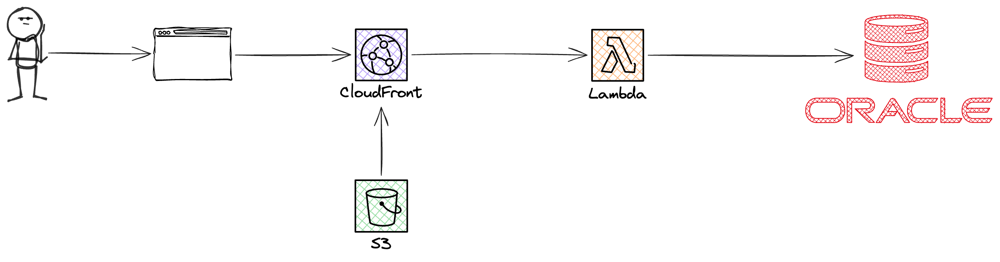
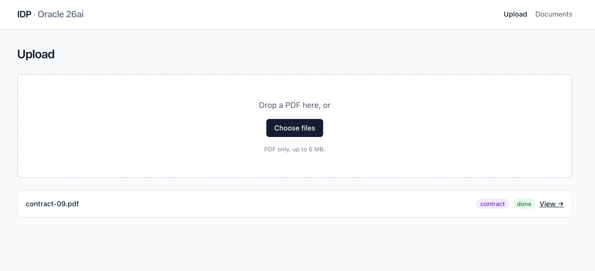
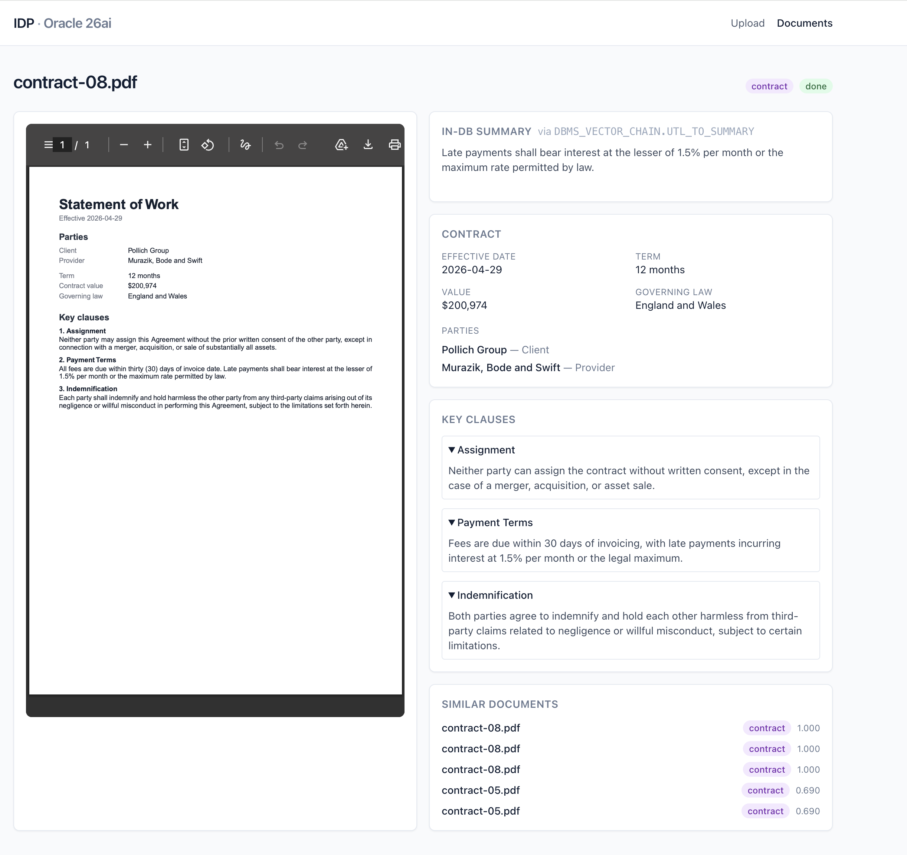
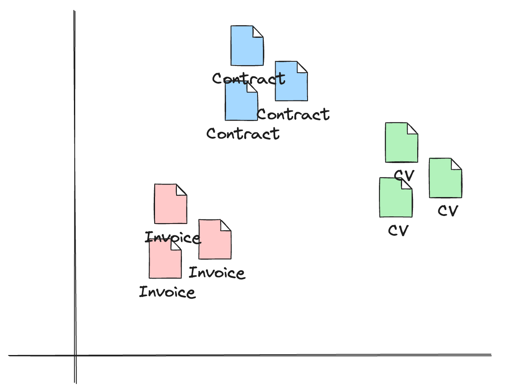
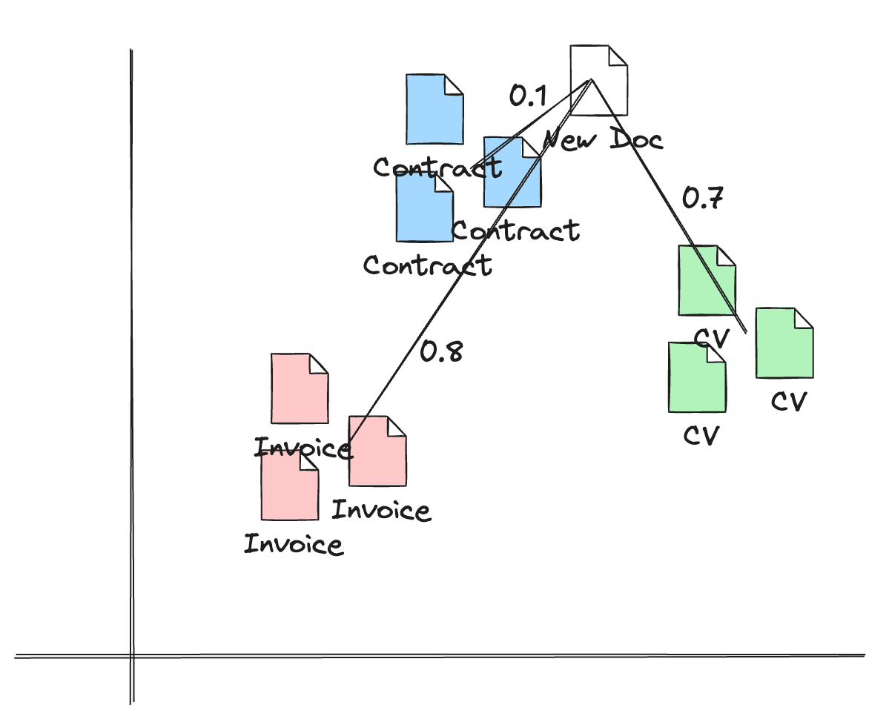
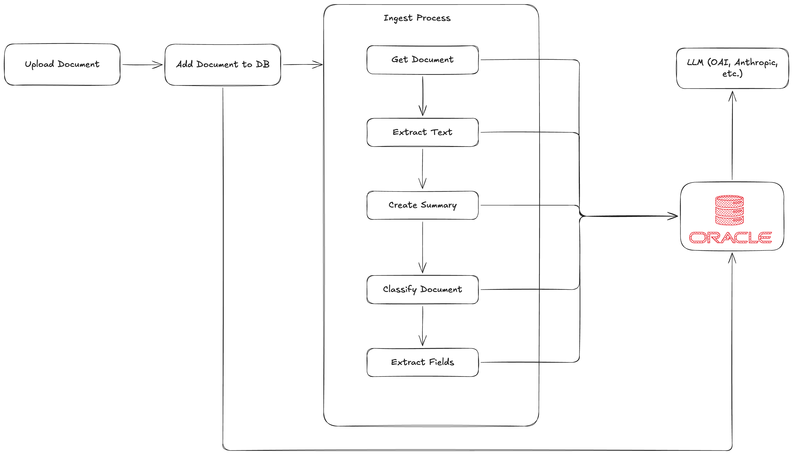

# Build an Intelligent Document Processor in One Data Store

Everybody wants to build AI applications.
But nobody knows a good use case.

One use case I have seen over and over again is to classify incoming documents.
In this article, I will show you how to build an Intelligent Documentation Processing platform.

## The Issues with Datastores

IDP (Intelligent Document Processing) Platforms are nothing new.
They are built and used in various companies already.
It is the typical internal tool where gen AI helps you a lot.

Building it required you to have multiple datastores.

- S3 for document blobs
- DynamoDB for key/values
- Pinecone for Vectors
- SQL for aggregations

…sometimes even more!

In this article, I want to demonstrate how you can build all of that with just one datastore: **Oracle Database 26ai**.

## What is Oracle Database 26AI?

The idea of their database is to bring AI **into an database engine**.
Instead of needing to hook up various OpenAI and Anthropic APIs with each other, your database can handle it.

For that, Oracle doesn't just give you vectors (you could also do this with Postgres Extensions).
But you can also do the whole embedding, generative text, classification and more **within the database**.

Let's use it to build it together!

## The Architecture

We have a typical REST & SPA architecture.
In that case, we host our frontend & backend on AWS.
The database lives in the free tier of the Oracle Cloud.



- Frontend: React SPA (Vite) & TanStack Router
- Backend: Hono API on Lambda
- Infrastructure: Serverless on Lambda
- CDN: CloudFront
- Hosting: S3 & CloudFront Origins
- Database: Oracle Cloud (OCI) Database

## The Application

The application's idea is to be able to detect incoming documents.
Think about all the various documents that arrive within your organization.
A major first task is to understand what the document is about and for whom it is.
This application is the first step in digitalising this process.

We defined different categories of documents:

- CVs for recruiting
- Invoices for accounting
- Contracts for lawyers

Our application is trained for those types of documents.
We have created several samples and "trained" our vectors with it.

Our system understands how invoices differ from CVs and how CVs differ from contracts.

### Uploading Documents



You can upload documents.
This will invoke the ingest process.
This process is explained more in detail later on, since we're still missing some basics for that.

### Viewing Documents & Content



In the application, you can look at the documents.
You see the PDF, all extracted content (depending on the type), and similar documents based on the vector search.

## Vectors

Vectors can be easily understood as points in a 2D system.



If you look at that diagram, you can see that each document type is close to each other.
And all various document types are far away from each other.

Vectors are used to calculate distances.
If a new document is coming in we calculate the distance to other documents.
The document type which is closest to our document type is the most probable one.

For example, if a new document is coming in we check out if it looks like an invoice or like a CV.
The result then looks something like this:

- `distance(new, invoice-sample) = 0.8` ❌
- `distance(new, cv-sample) = 0.6` ❌
- `distance(new, contract-sample) = 0.1` ✅

The distance with the lowest distance is the most similar.
So we take this one.



## Ingesting Documents

The main process of this application is the ingestion process.



The process is doing the following:

1. User uploads a document in the UI
2. The API adds this document as a row with status `pending` into the SQL database
3. Now the actual ingest process is invoked
4. We fetch the document again
5. We call `DBMS_VECTOR_CHAIN.UTL_TO_TEXT` to read all text from this document and save it in the database
6. Call `DBMS_VECTOR_CHAIN.UTL_TO_SUMMARY` to generate a summary → Save in DB
7. Create embeddings with `VECTOR_EMBEDDING` using an ONNX model loaded into the database
8. Classify the document (invoice, cv, contract) by running a k-NN vector search against documents we already labeled
9. Extract relevant fields with `DBMS_VECTOR_CHAIN.UTL_TO_GENERATE_TEXT`

This list seems straightforward.
But it is actually insane that all of that is working with just **one database**.

The database is not just storing an object file.
It is also calling LLM APIs, calculating vector embeddings, and extracting fields.

Let's look into that in a bit more detail.

### Text Extraction in database

The call `DBMS_VECTOR_CHAIN.UTL_TO_TEXT` is able to read a BLOB document, and returns written text.
It can handle multiple doc types like

- PDF
- JSON
- DOC
- HTML
  … and more!

In SQL you simply call:

```sql
UPDATE documents
SET extracted_text = DBMS_VECTOR_CHAIN.UTL_TO_TEXT(file_blob)
WHERE id = HEXTORAW(:id);
```

And it sets the extracted text to the field `extracted_text`.

For images you should use a vision model.
But for our use-case this works out pretty great.

### Summaries

Oracle's database is also able to summarise your document by using `UTL_TO_SUMMARY`.
Without any direct LLM call.

```sql
SELECT DBMS_VECTOR_CHAIN.UTL_TO_SUMMARY(
  extracted_text,
  JSON('{"provider":"database","glevel":"sentence","numSentences":3}')
) FROM documents WHERE id = HEXTORAW(:id);
```

Here is an example of the generated text in the DB vs. the LLM summary:

In-DB extractive summary:

> Reseller Agreement Effective 2026-05-10 Parties Client Kohler - Hermann Provider Blick and Sons Term 36 months Governing law England and Wales Key clauses 1. Governing Law and Venue This Agreement is governed by the laws specified

LLM abstractive summary:

> Reseller Agreement between Kohler - Hermann (Client) and Blick and Sons (Provider) for a 36-month term effective May 10, 2026, governed by England and Wales law. Agreement covers intellectual property ownership, liability limitations, payment terms, termination provisions, force majeure, indemnification, and assignment restrictions.

The extractive version costs nothing per call. The abstractive version reads better. For most UIs both fields are useful. Show the LLM one in the doc card, use the extractive one in keyword search highlights.

### Embeddings

Before we can classify by vectors, we need a vector.
Oracle 26ai can generate embeddings inside the database from an ONNX model that you upload once and reuse.

We use Oracle's pre-built `all_MiniLM_L12_v2.onnx` (384-dim output). It is loaded into the database once with `DBMS_VECTOR.LOAD_ONNX_MODEL` and registered under the name `doc_embedder`.

After that, generating the embedding for a document is a single SQL statement:

```sql
UPDATE documents
SET embedding = VECTOR_EMBEDDING(doc_embedder USING extracted_text AS data)
WHERE id = HEXTORAW(:id);
```

No external embedding service. No second store. The 384-dim vector ends up in the same row as the BLOB and the extracted text. The table has an HNSW vector index on the `embedding` column so distance queries hit the graph instead of doing a brute-force scan.

### Classify Documents

We have two ways of classifying documents:

1. Ask your LLM "What kind of doc is it?"
2. Look through similar documents by asking your vectors.

Typically, I would advise you to do both.
But to actually understand the capabilities of this database we go with **pure vectors**.

That means we use our kNN algorithm (k-nearest neighbors) to find the documents that are closest to the new incoming document.
And simply say: This is the same.

This is done by using the following SQL statement:

```sql
SELECT b.doc_type FROM documents a, documents b
WHERE a.id = :new
  AND b.id != :new
  AND b.status = 'done'
ORDER BY VECTOR_DISTANCE(a.embedding, b.embedding, COSINE)
FETCH FIRST 5 ROWS ONLY
```

This is the only classification step.
No LLM is involved. The same vector that powers the "similar documents" panel in the UI also assigns the document type.

### Extracting Fields

Vectors can tell us **what** the document is.
They cannot tell us **what is in it**.

For that we need structured output. Vendor name, invoice number, due date, line items, parties, governing law, skills, education. Things that differ per document type and that we want back as typed JSON.

This is the one place where we still call an LLM. The DB does the call for us via `DBMS_VECTOR_CHAIN.UTL_TO_GENERATE_TEXT`, routed to OCI Generative AI (Cohere Command R+ by default).

```sql
SELECT DBMS_VECTOR_CHAIN.UTL_TO_GENERATE_TEXT(
  :prompt,
  JSON('{
    "provider":        "ocigenai",
    "credential_name": "OCI_CRED",
    "url":             "https://inference.generativeai.eu-frankfurt-1.oci.oraclecloud.com/20231130/actions/chat",
    "model":           "cohere.command-r-plus-08-2024",
    "chatRequest":     { "maxTokens": 4096, "temperature": 0 }
  }')
) AS out FROM dual;
```

The prompt includes the extracted text and a JSON Schema generated from our Zod schema for the doc type. We get back a CLOB with the model's JSON answer.

In TypeScript we validate the response against the same Zod schema. If validation fails, we retry once with the Zod error message added to the prompt so the model can self-correct. After that, the typed object goes into `document_fields.payload`.

One LLM call per document.
Zero LLM calls for classification.
Zero LLM calls for embeddings.
Zero LLM calls for text extraction.

## Deployment

You can deploy the overall solution in your AWS account and use it!
It is hosted on S3 & CloudFront.

The API lives in a single Lambda Function with a function URL.
The setup should be free of charge if you don't have a huge scale.

Have fun trying it out!
